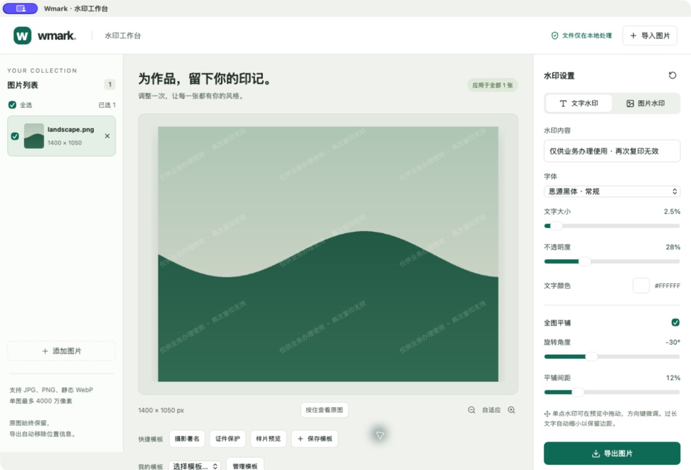
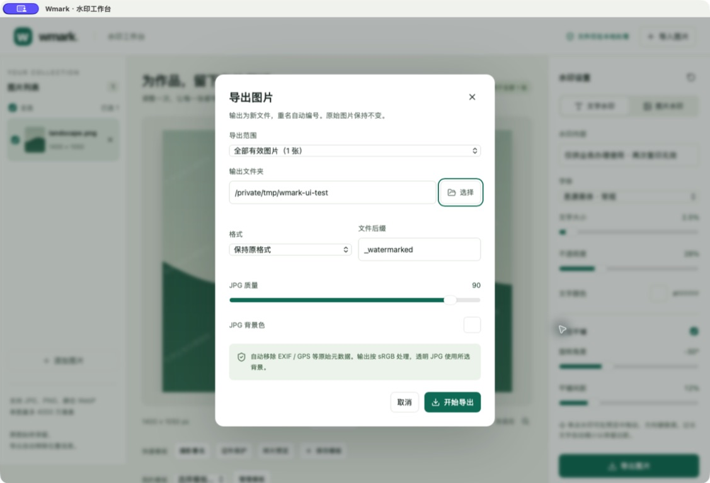
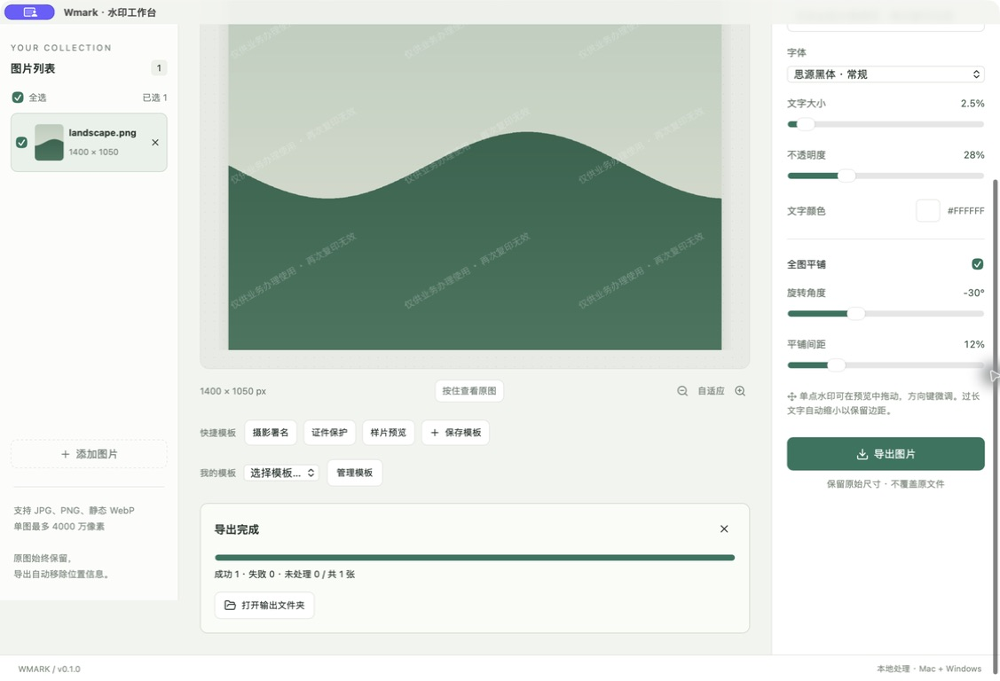
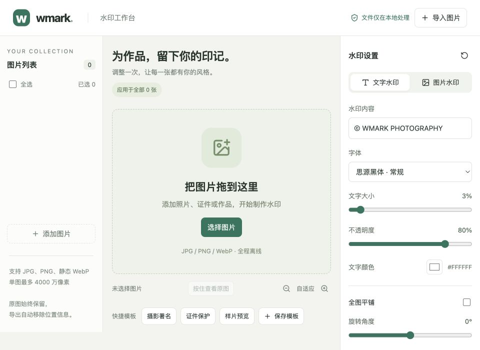

# Wmark 前端代码门禁

## 结论与范围

PASS。机器判定见同名 JSON。审查范围为 R01–R08 的界面承载、字段和对应 IPC 链路；发行与跨平台构建结果见最终测试报告。基线：docs/implementation-plan.md、prototype/index.html。源码：src/、src-tauri/src/、crates/wmark-core/。

此 PASS 不表示 Windows 桌面视觉已经人工验收，不覆盖 PDF/视频等未纳入首期的能力。

## 九类检查

| 检查 | 结果 | 证据 |
| --- | --- | --- |
| Spec 完整性 | PASS | R01–R08 主路径有实现、54 项本地测试中的对应用例、真实 Mac 导入预览导出 |
| 日期时间控件 | 不适用 | 无日期字段 |
| 实体选择 | PASS | 模板稳定 ID + select；格式/字体固定枚举 |
| 交互链路 | PASS | api.ts → Tauri commands → core；真实目录选择与文件输出 |
| 流程状态 | PASS | 初始/加载/错误/成功/取消/部分失败及重试；前端和核心测试 |
| 字段契约 | PASS | TS/Rust camelCase、范围校验、PNG/WebP 无损与 JPG 质量语义 |
| 错误处理 | PASS | 导入/预览/导出失败有可见反馈；取消与重试测试 |
| 横向表格操作列 | 不适用 | 无表格或表格能力，图片使用虚拟列表 |
| 字体与可读性 | PASS | 真实 Mac 截图与 960×700 浏览器计算样式，未见横向溢出 |

## UI 契约矩阵

所有操作均为本地设备用户，无账号/角色权限系统。

| 需求 | 场景 / 承载 | 字段 / 操作 | 状态和结果 | 证据 |
| --- | --- | --- | --- | --- |
| R01–R02 | 主工作台空态、原生文件选择、左侧列表 | 图片名/尺寸/错误、导入、选择、移除 | 成功图片可选，坏文件保留原因 | App.test.tsx；Mac 原生导入 |
| R03–R04 | 右侧设置、中间预览 | 内容/Logo、字号/透明度/颜色/角度/位置/平铺、比较/缩放 | 防抖预览、过期结果抑制、错误可重试 | App.test.tsx；imaging.rs；实际预览 |
| R05 | 模板管理弹窗 | 名称、保存、选择、删除 | 本地持久化、重启恢复 | 配置往返测试；模板 UI 测试；重启已安装应用 |
| R06 | 导出设置弹窗 | 范围/目录/格式/后缀/JPG 质量/背景 | 校验、取消关闭、提交后进入任务 | export-dialog.png；App.test.tsx |
| R07 | 主区域任务卡 | 进度、成功/失败/未处理、取消、失败原因、重试、打开目录 | 独立取消态；重试使用原快照 | App.test.tsx；output.rs 测试；export-complete.png |
| R08 | 输入和导出边界 | 动画/尺寸限制、元数据去除、原图保护 | 错误有原因，原文件不覆盖 | acceptance.rs |

## 修改前后截图

| 场景 / 条件 | 修改前 | 修改后 | 核验 |
| --- | --- | --- | --- |
| Mac 桌面工作台，合成图片，系统窗口截图 | 新建项目在实现前没有已安装桌面应用；历史 HTML 原型不是安装版截图，不冒充前态 |  | 三栏结构、平铺中文、水印控件 |
| Mac 导出设置弹窗 | 无已安装前态 |  | 对话框层级、可访问焦点、目录和导出参数 |
| Mac 最终安装版，任务完成，页面滚动至下部 | 无已安装前态 |  | 成功 1、失败 0、结果操作可达 |
| 浏览器界面布局，960×700，空态 | 无同视口截图 |  | 内容宽度 960px，无水平溢出；下部设置纵向滚动可达 |

截图不包含用户原始图片、证件、模板名称或私人目录。公开报告采用仓库相对路径，避免暴露本机路径。

## 字体证据

浏览器实际计算：标题 25px / 35px / 650，主按钮 14px / 18.9px / 400，表单标签 13px / 19.5px，辅助说明 12px / 19.8px。最小宽度标题 23px；输入内容 14px。未通过整体缩放来掩盖溢出。Mac 真机截图同时检查输入、说明、设置和导出对话框。

## 验证命令

- npm test：20 通过，0 失败 / 跳过。
- npm run build：TypeScript 与 Vite 构建通过。
- cargo test --workspace：29 核心 + 5 桌面合约测试通过。
- cargo run -p wmark-core --example verify_output -- <合成输入> <桌面输出>：1400×1050 全像素严格相等。
- evaluate_gate.py：退出码 0。

## 缺口与限制

- React 测试 mock IPC；真实图像处理在核心集成测试，真实 Mac 链路单独操作验证。
- 原生拖放和所有键盘修饰组合未做穷举硬件测试；程序事件与输入代码已审查。
- 未做 Windows 人工视觉验收、屏幕阅读器穷举测试或跨所有显示比例测试。
- 未获得实现前桌面截图，不声称完成像素级前后对比。
