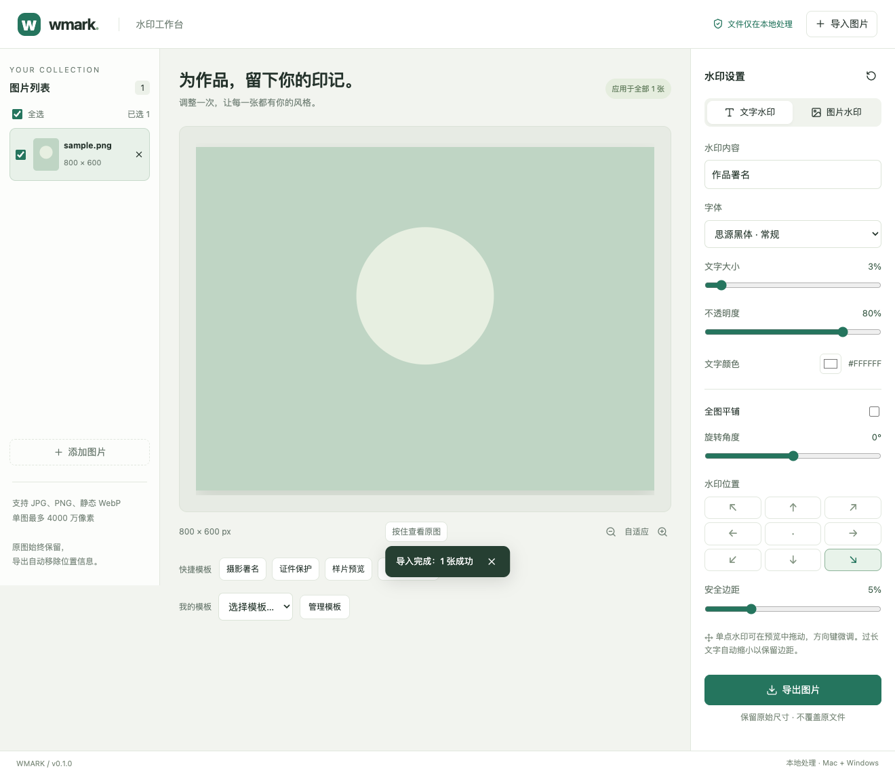
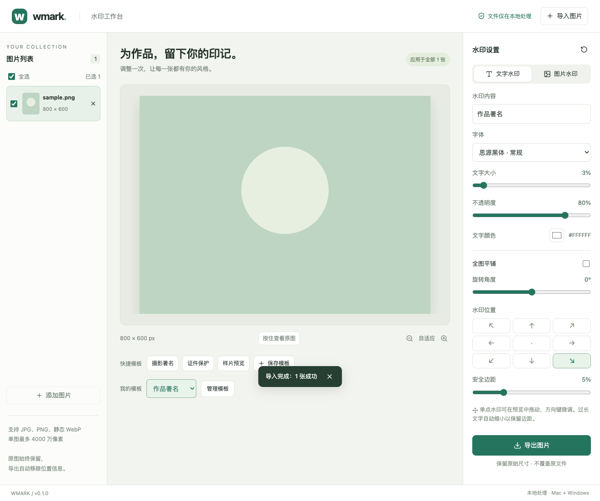
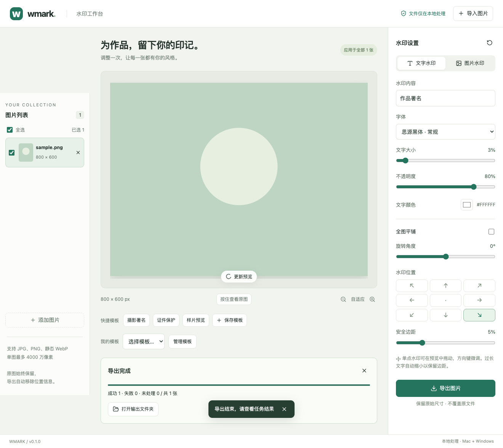
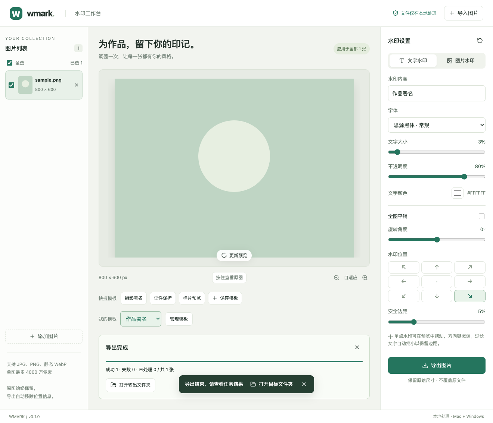

# 导出提示、模板选中状态与工作台布局修复

- 日期：2026-09-10
- 状态：本地代码已修复并验证；未提交、推送或发布安装包。

## 问题与修复

1. 导出完成通知原先只有关闭按钮，没有自动关闭逻辑。现在提供“打开目标文件夹”，使用本次导出的目录；5 秒后自动隐藏，任务结果和原有文件夹入口保留。点击打开时关闭提示，打开失败显示错误。新通知及组件卸载会清理旧计时器。
2. 我的模板下拉框原先固定 `value=""`。现在保留应用模板的 ID，显示名称和绿色选中效果；参数与模板不一致或模板被删除时取消选中效果。模板管理入口应用模板也同步选中。
3. 左栏原先限定视口高度并使用 sticky，右侧设置内容撑高页面后，左栏提前结束。移除该限制，让两栏随网格等高；图片列表仍可独立滚动。
4. 预览区常规高度减少 40px，最小高度从 310px 改为 280px，最大高度从 680px 改为 640px。收紧设置区字段间距，标准测试状态下整页降低 41px。

## 变更范围

- `src/App.tsx`：完成通知操作及计时、模板选择状态。
- `src/style.css`：两栏对齐、预览高度、字段间距、选中样式。
- `tests/App.test.tsx`：新增三个用户行为回归测试。
- 工作区原有 Rust 验收测试改动和图标文件未修改。

## 修复前后对照

本地 Vite 页面，Chromium，1320 × 900 视口，默认缩放、相同测试模板及合成图片。文件 API 使用测试替身，未读取真实用户图片。截图为完整页面，因此修复后截图总高度更小。

### 模板与布局

修复前模板显示占位文案，左栏底部为 864px、右栏底部为 1107.61px。修复后模板显示“作品署名”并高亮，两栏底部均为 1066.61px，直接连接页脚。预览高度从 570px 降至 530px。

### 导出完成通知

修复后通知新增“打开目标文件夹”。浏览器操作验证传入 `/out`，另一轮导出验证 5.2 秒后通知消失。

## 验证

- `npm run check`：通过，前端 23 项测试、Rust 34 项测试、TypeScript 与 Clippy 检查均通过。
- `npm run build`：通过。
- Chromium 交互：选中模板、导出、通知打开目录、超时隐藏均通过，无页面运行错误。
- 前后布局通过浏览器元素实际坐标对比。

## 验证边界

本次浏览器验证使用文件 API 替身；未重新打包桌面应用，也未验证 Finder 窗口实际弹出。调用的是项目既有 `open_output` 后端接口。未向外部平台推送或发布。
